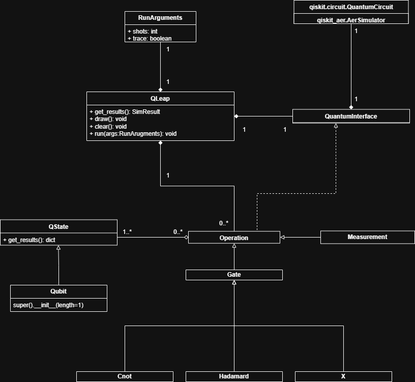

Architecture
============

This section provides an overview of the architecture of the QLeap quantum programming language. It covers each class and its role in the overall design of the language, as well as how they interact with each other to enable quantum programming. 
The architecture is designed to be modular and extensible, allowing for future enhancements and additions to the language.

UML Diagram
-----------

   UML diagram of the QLeap architecture, showing the main classes and their relationships.

QLeap Class
-----------

The QLeap class collects an instance of the QuantumInterface and RunArguments class while collecting
zero to many instances of the Operation class. This class uses these instances to construct and run a
quantum circuit based on user instructions that are abstracted within these instances.

QuantumInterface Class
----------------------

The QuantumInterface class is constructed such that it is the only interacting component within the
API that accesses any external component; in this case, the external component is Qiskit from
which the class stores instances of classes. In particular, the class stores an instance of the QuantumCircuit
class from Qiskit as QLeap’s backbone. However, if there were to be a need to switch out Qiskit as the
backend, the class allows for easy modification as the only class that needs to be adapted to the
new backend library. Within the class lies the specific logic to construct a Quantum circuit as it is tied
to whatever library that QLeap is wrapping. Alongside that, all possible operations within the circuit are
referenced back to it’s counterpart in the wrapped library.

It is important to note that this class is not intended to be accessible by the user and is a class that is
constructed to abstract complex logic. While it substantiates the logic to the various quantum operations,
specific information of the said operations should be examined within the relevant class definitions.
   
RunArguments Class
------------------
The RunArguments class contains parameters that relate to the runtime of the Quantum Circuit. The
user must either allow for a default set or configure custom selections. The class gets collected one to one
into the QLeap class. As of now, the class is not implemented within the code base.

Operation Class
---------------
The Operation class is a parent class for any child quantum operations class such as measurement or the
various quantum gates. Zero to many instances of this class are collected into the QLeap class. In addition,
zero to many instances of this class aggregate one to many instances of the QState class and/or the Qubit
class. All child classes are aware of the QuantumInterface class in order to define how they apply onto
the constructed quantum circuit.

Users are not intended to utilize this class in their programs; instead, users should use the defined
child classes.

Measurement Class
-----------------
The Measurement class is a child of the Operation class that pertains to measurement operations on the quantum circuit.

Gate Class
-----------
The Gate class is a child of the Operation class and is the parent class of any subsequent quantum gate class within the wrapper library. It is constructed to denote the differentiation between operations.

Hadamard/CNOT/X Classes
-----------------------
The Hadamard/CNOT/X classes is a child of the Gate and Operation class that pertains to applying the Hadamard/CNOT/X gates onto qubits.

QState Class
------------
The QState class is the parent class of the Qubit class and refers to a collection of Qubits. One to many instances of the class are aggregated into zero to many instances of the Operation class and it's child classes. The class and it's child are aware of the QLeap class, which is needed upon initialization of any instance.

The class and it's child calls upon the \_allocate() method in QLeap in order to initialize the start and end fields, the length between those two indices corresponds to the \_len field defined by the user during instance creation. The QLeap class allocates based on it's \_qubit\_count field which tracks how many qubits have been created and the end index of the previous qubit allocation call. 

Qubit Class
------------
The Qubit class is a child class of the QState class. It initializes the same way as it's parent class; however, the length is predetermined to be of size one. 